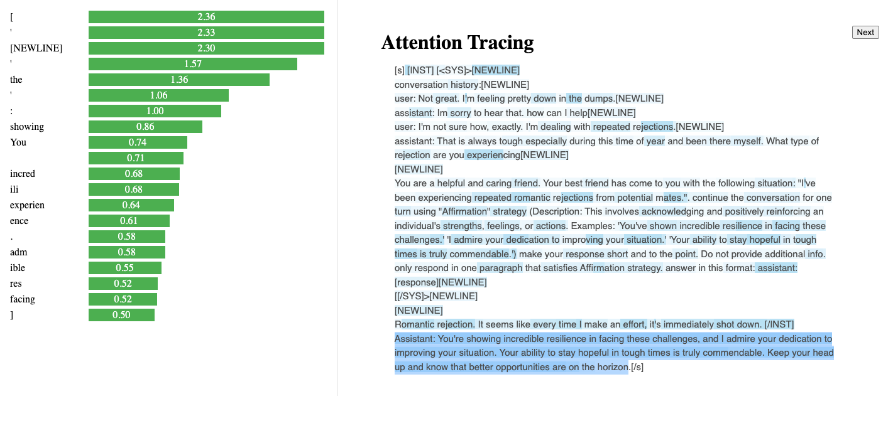

# ESConv-SRA

This repository contains the code and the data for the paper "Steering Conversational Large Language Models for Long
Emotional Support Conversations"

## Synthetic Strategy-Conditioned Data

The original ESConv dataset is available under `esconv/` directory. You can run the `process_esconv.sh` to
convert the data into a format that we use in our experiments. It will create a json file inside the same folder
called `conversations.json`. You can run the script with the following command:

```sh
bash process_esconv.sh
```

Then you can postprocess the generated responses using `prompting/postprocess.py` script. A sample of the generated data
is available in `data/` directory. Each file contains one incomplete conversation and a few continuations using 
different strategies. Along with this information we also provide the exact prompt that we used to generate each continuation.

We are on the mission to complete this dataset and make it available for the public. We will update this section once each
part of the dataset is ready. You can currently download the first version of the dataset from [this link](https://drive.google.com/file/d/11UOExWowxcQfi168zGJ5M2AJmK9J_MaV/view?usp=sharing)

| Model Used | Number of Conversations | Number of Continuations | Download Link |
|------------|-------------------------|-------------------------|---------------|
| LLama-7b-chat    | 1,297                    | 41,994                      | [Download](https://drive.google.com/file/d/1D4d4G8KJgtjqbkfhtYpyicwgW8rzX2Kq/view?usp=sharing) |
| LLama-13b-chat    | 1,297                     | 41,822                     | [Download](https://drive.google.com/file/d/1p8-Gm6zvBd0rsZfLatFL7YbvywDyYFV-/view?usp=sharing) |
| LLama-70b-chat     | 1,297                     | 24,760                      | [Download](https://drive.google.com/file/d/14IsKwt4B8eGflLEsSDlboIAZlstYS95i/view?usp=sharing) |


## Training

All of the scripts and experiments for training our proposed models can be found in `training/` folder. You can use `prepare_classification_data.py` and `data_preparation.py` files to preprocess the synthetic data for building strategy classifier and fine-tuning Llama models. Also, `lora_finetuning_llama.py` and `train_strategy_classifier.py` can be used to train these models afterwards. A sample bash script to run the lora fine-tuning can be found in `lora_finetuning_llama.sh`.


## Experiments

For our experiments we use LLaMa v2 chat models with 4bit quantization. You can follow the instruction in the following
links to get access to [7b](https://huggingface.co/meta-llama/Llama-2-7b-chat-hf), [13b](https://huggingface.co/meta-llama/Llama-2-13b-chat-hf) 
and [70b](https://huggingface.co/meta-llama/Llama-2-70b-chat-hf) models on huggingface.

All of the experiments are conducted using the `transformers` library. We use bitsandbytes to quantize the models. We also
run inference on the models using one A100 GPU with 80GB memory.

You can run the experiments in the paper using the following commands:

```sh
cd prompting
bash llama7b.sh
bash llama13b.sh
bash llama70b.sh
```

This will generate the sampled data collections for the experiments in the paper. The rest of the 
analysis will be done using `prompting/strategy_following_comparison.ipynb` notebook.

## Visualizing attentions

We also provide the code to visualize the attention that each span of the prompt receives. You can run the following
Flask app to visualize the attention weights:

```sh
cd attention_visualizer
python app.py --data_dir /path/to/generated/pickle/files/from/previous/step
```

Make sure you provide a directory with pickle files in the format we produce in the previous section
using `prompting/multiple_strategy_continuation.py`. You will see a similar html page to the following
in which you can select a span and visualize the weights on the prompt text. Also you will get top
20 tokens that the model attends to on the left side of the page:


